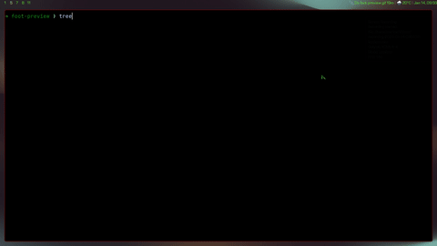

# foot-preview

Preview foot themes in a small fzf picker and persist the selection back to
`foot.ini`. This project was fully built by codex.



## What it does

- Lists themes from `~/.config/foot/themes`.
- Colors each theme name using that theme's own foreground color.
- Live-previews a theme as you move the cursor.
- Persists the selection by updating the `include=` line in
  `~/.config/foot/foot.ini`.

## Assumptions

- You are running inside foot (the preview uses OSC color sequences written to
  `/dev/tty`).
- `fzf` and `foot` are installed.
- Themes are stored as individual files under `~/.config/foot/themes` and each
  theme has a `[colors]` section.

## Dependencies

- `foot`
- `fzf`

### Install

Arch:

```sh
sudo pacman -S foot fzf
```

Ubuntu:

```sh
sudo apt update
sudo apt install foot fzf
```

Fedora:

```sh
sudo dnf install foot fzf
```

## Usage

```sh
./foot-preview
```

- Move the cursor to preview a theme.
- Press Enter to persist the selection.
- Press Esc to exit without changes (the original theme is restored in the
  current terminal).

## Configuration

- `FOOT_THEMES_DIR`: override the themes directory (default:
  `~/.config/foot/themes`).
- `FOOT_CONFIG`: override the foot config path (default:
  `~/.config/foot/foot.ini`).

## Notes

- The script updates the existing `include=` line in `foot.ini` that points
  into the themes directory. If none exists, it inserts one.
- Preview changes are applied only to the current terminal session (or all
  attached tmux clients) until you press Enter.
